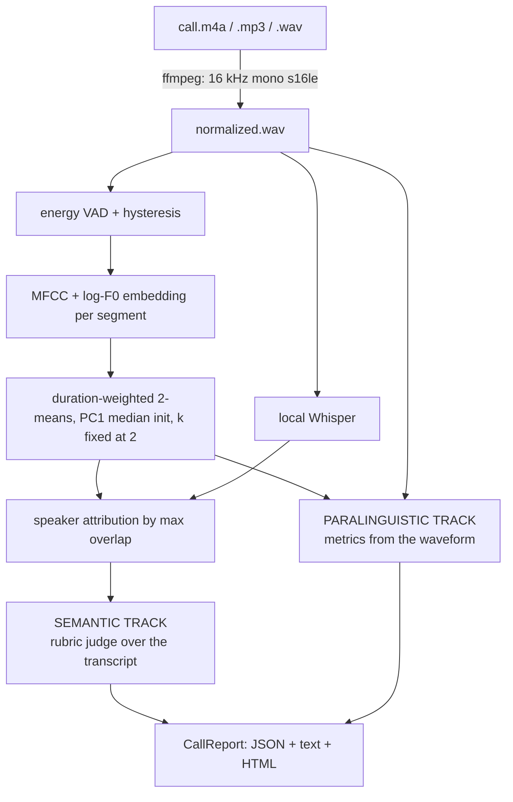

# callscope

Scores two-speaker call recordings on two parallel tracks — what was said, and how it was said — entirely on the local machine.

## The problem

Call QA at most organizations means a supervisor listening to a 2% sample and filling in a spreadsheet. The other 98% is never reviewed, and the sampled 2% is scored inconsistently because "was the customer's issue captured?" means something slightly different at 9am than at 4pm. The vendors who automate this want the audio uploaded to their cloud, which is exactly the thing a regulated business is not permitted to do with a recorded customer conversation.

callscope scores every call, deterministically, without the audio leaving the machine.

## No audio leaves the machine

Normalization, transcription, diarization, and both scoring tracks run locally. There is no telemetry, no model download at scoring time beyond the Whisper weights your chosen backend caches, and no network call in the default configuration.

The single exception is opt-in and off by default: if a rubric sets `judge: {backend: llm}`, transcript excerpts for that rubric's criteria are sent to the configured API. Nothing else ever is, and the generated report says so in its footer when that path is active.

## Quickstart

Requires Python 3.12 and `ffmpeg` on PATH (`brew install ffmpeg` / `apt install ffmpeg`).

```bash
git clone <this repo> && cd callscope
uv venv --python 3.12 && source .venv/bin/activate
uv pip install -e ".[dev]"

# What can this machine actually do?
callscope doctor

# Synthesize a two-speaker call and score it end to end. No input file,
# no network, no Whisper install required.
callscope demo --out reports/

# Score a real recording. Any format ffmpeg can decode.
uv pip install -e ".[mlx]"        # Apple Silicon; or .[faster] / .[openai]
callscope analyze call.m4a --rubric my_rubric.yaml --out reports/

# Already have a transcript? Skip the model entirely.
callscope analyze call.m4a --transcript call.json --rubric my_rubric.yaml
```

callscope is not published to PyPI; install it from a checkout, which is why
every install line above is `-e "."` and not a package name.

`analyze` writes `reports/<call_id>.json`, `.txt`, and `.html`.

Run the checks:

```bash
python -m pytest        # 202 tests, ~5 s, no network, no credentials
ruff check src tests    # rule set is pinned in pyproject.toml
```

The suite runs without ffmpeg too: the twelve tests that shell out to it are
marked `requires_ffmpeg` and skip cleanly when it is absent.

## How it works



**Stage 1 — normalize.** Everything is forced to 16 kHz mono 16-bit PCM by ffmpeg before anything else runs, and container metadata is stripped (call recordings routinely carry PII in ID3 tags). Downstream code may therefore assume canonical audio and contains no sample-rate branching.

**Stage 2 — diarize.** An energy VAD with an adaptive noise floor and Schmitt-trigger hysteresis finds speech; long segments are split so a boundary can land mid-run. Each segment gets a fixed-length embedding — CMVN'd MFCC means and standard deviations plus log-F0 mean and spread, block-weighted after standardization — and a duration-weighted 2-means assigns them, initialized by splitting at the weighted median of the first principal component. `k` is fixed at 2, which is the whole point: the hard part of general diarization is estimating the speaker count, and in call QA you already know it. A mean silhouette coefficient below 0.50, or a minority cluster of fewer than two segments, collapses the result back to one speaker rather than reporting a split the data does not support.

**Stage 3 — transcribe.** Backend chosen at runtime, preference order `mlx-whisper` → `faster-whisper` → `openai-whisper` → `fixture` (a JSON transcript you supply) → `null`. Transcript segments are attributed to speakers by maximal temporal overlap with the diarized turns.

**Stage 4 — score, twice, independently.**

*Semantic* — rubric criteria evaluated against the transcript. The rubric is a user-supplied YAML/JSON file; nothing about the criteria is compiled in. Two example rubrics ship with the package to demonstrate that the engine is domain-agnostic.

*Paralinguistic* — computed from the signal, never from the text: talk-time seconds and ratio, turn counts, overlap seconds and events, per-speaker interruption counts, silence distribution (p50/p90/longest) and dead-air events, mean response latency, syllable-nucleus speech rate from the amplitude envelope, and F0 mean plus variability in both Hz and semitones. The overlap and interruption metrics depend on a diarizer that emits overlapping turns; the default one does not — see Limitations.

## Design decisions

- **`k=2` is a constraint, not a hint, and determinism outranks average accuracy.** Fixing the speaker count removes the estimation step that dominates general-purpose diarization error and lets the clusterer be fully deterministic: no random restarts, so the initialization is decisive rather than merely convenient. Farthest-pair init is the obvious deterministic choice and it is the wrong one — the farthest-apart pair of segments in a real call is usually one outlier (cross-talk, a cough) against everything else, and 2-means then converges with that outlier alone in its own cluster. Splitting at the weighted median of PC1 cannot isolate a single point. Relatedly, a between-over-within centroid ratio is useless as a single-speaker guard, because 2-means maximizes exactly that quantity by construction and scores a monologue about as well as a real two-party call; the silhouette coefficient collapses when the data has no real bimodality, which is what the guard needs.

- **pyannote is optional, not required.** pyannote is more accurate than the clustering here, and the README says so plainly below. But it needs a HuggingFace token and manual acceptance of two model licences, which means a reviewer who clones this repo cannot run it. Making the accurate-but-gated backend optional and the adequate-but-free backend default is the trade that keeps the tool actually runnable. `--diarizer pyannote` uses it when a token is present.

- **The two tracks never see each other's inputs.** The semantic judge receives a `JudgeContext` that deliberately excludes the audio buffer; the paralinguistic analyzer takes the transcript only for words-per-minute and works fine without it. Keeping them separable is what makes a disagreement between them informative — "the agent said all the right words but talked for 80% of the call" is the finding a supervisor actually wants, and it is only expressible if the two numbers were derived independently.

- **Transcription failure degrades the run instead of ending it.** No Whisper backend installed, or a model that crashes, produces an empty transcript, a zeroed semantic track, an explicit warning in the report, and a complete paralinguistic profile. Similarly, a judge that raises on one criterion records that criterion as a zero-with-reason and lets the other criteria finish. Batch QA jobs fail on one file out of four hundred; the design assumption is that this happens, not that it doesn't.

- **The LLM judge interface exists before the LLM judge is needed.** `SemanticJudge` is a two-method protocol with a name registry. The shipped keyword judge and the shipped Anthropic-backed judge both implement it, and switching between them is a line in the rubric file. That was worth building up front because the alternative — regex scoring wired directly into the pipeline — is the version that has to be rewritten rather than reconfigured.

## Semantic track: keyword now, LLM when you need it

The default judge matches user-supplied regexes against in-scope transcript segments and emits timestamped evidence for every hit. It is fast, free, offline, and perfectly reproducible. It also matches phrasings rather than meaning, and will miss "I'll get that back out to you today at our expense" if your pattern expected "reship".

To move a rubric to model-based judging, change one block:

```yaml
judge:
  backend: llm
  model: claude-opus-5
  options:
    effort: medium
```

and install the extra (`uv pip install -e ".[llm]"`). Nothing else changes — same `CriterionResult`, same evidence timestamps, same report. `docs/llm-judge.md` covers the prompt contract, the JSON schema the model is constrained to, and how to point the same interface at a self-hosted model instead.

## Limitations

Read this section before trusting a number out of this tool.

- **Diarization is meaningfully less accurate than pyannote.** MFCC-plus-pitch embeddings with 2-means will confuse two speakers of similar pitch and timbre, and will place turn boundaries late when speakers do not pause between turns. Expect degradation on cross-talk, on speakerphone, and on heavily compressed telephony codecs. `metadata.diarization_separation` in the report is the honest signal: it is the mean silhouette coefficient of the two-cluster solution, and a value near or below the 0.50 threshold means the two clusters were not well separated and the attribution should not be trusted. That threshold is a heuristic calibrated against synthetic monologues (~0.40) and synthetic two-speaker calls with similar voices (~0.59) — it is not derived, and it has not been tuned against real recordings. Use `--diarizer pyannote` for anything where per-speaker numbers carry consequences.

- **Overlap and interruption counts are always zero under the default diarizer.** The built-in clusterer assigns each VAD segment to exactly one speaker, so the turns it emits are disjoint by construction and nothing can overlap. `overlap_seconds`, `overlap_events`, and `interruptions` are computed correctly and tested against known-overlapping ground truth, but they only become non-zero with `--diarizer pyannote`, which does emit overlapping turns, or when you supply turns yourself via `analyze_paralinguistics`. Do not read a zero in those fields as "nobody interrupted".

- **Only two of the five transcription backends have been exercised.** `fixture` and `null` are covered by the test suite. The `mlx`, `faster`, and `openai` backends are selected and dispatched by tested code, but the calls into the model libraries themselves have never run against live weights here — no Whisper wheel is installed in the development environment. The same caveat applies to the pyannote diarizer: its unavailability and fallback behaviour are tested, its success path is not.

- **Diarization accuracy is validated only on synthetic audio.** The test fixture is a source-filter synthesizer — voice-*like*, with known F0, formants, talk times, and overlaps, which is what makes the metrics assertable against ground truth. It is not speech. No diarization error rate has been measured on real recordings, and none is claimed.

- **The VAD is energy-based.** It will call sustained background noise speech and will clip quiet speech. It has no music, DTMF, or hold-tone detection. Silero or WebRTC VAD would be better; both were rejected as hard dependencies (torch, and unmaintained wheels respectively).

- **The pitch tracker is autocorrelation, not YIN or CREPE.** It is adequate for per-speaker F0 *statistics* on reasonably clean audio and will make octave errors on creaky or breathy voices. Do not read individual frame values as ground truth.

- **Speech rate is a syllable-nucleus proxy.** It counts amplitude-envelope peaks, so it undercounts fast connected speech and overcounts modulated noise. It is reported because it survives transcription failure; words-per-minute is the better metric when a transcript exists, and both are reported when both are available.

- **The example rubrics are illustrative, not calibrated.** They exist to demonstrate the format. Any rubric used for real scoring needs to be written against a sample of your own calls and checked for agreement against human scores before anyone's performance is measured with it.

- **Two speakers only.** Three-way calls, conference bridges, and warm transfers are out of scope. A third speaker will be folded into one of the two clusters, silently.

- **Mono only.** If you have genuinely separate per-speaker channels, diarization is unnecessary and you should split the channels and score each directly — callscope does not do this for you.

- **English-oriented defaults.** The DSP is language-independent, but the example rubric patterns and the default Whisper model (`base.en` for the CPU backends) are not.

- **No PII redaction.** Transcripts are written to disk verbatim. If you enable the LLM judge, redaction is your responsibility and there is no hook for it yet.

## License

MIT. See [LICENSE](LICENSE).
